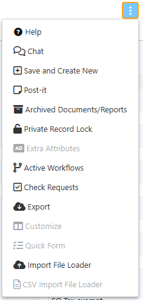

# Window handling 
Navigation in Idempiere is one of the great benefits that it offers since its interface is very
friendly, it allows configuration in multiple languages and when placing the mouse pointer
on each of its icons or buttons, it clearly shows the name and/or role it plays. To enter the
system you may use any browser (Chrome, Firefox, Explorer ...) by entering the URL
provided. For optimum performance navigating the system with Google Chrome.

# Components of iDempiere Window

Some important areas are:
- Favorites
- Recent items
- Activities
- Views
not seen above further right are
- Calendar
- Performance (Dashboard)
- Help (optionally displayable)

# Favorites
The favorites are usere specific. In this view you can add processes and / or documents to which you can access
more frequently, gaining time and accessing more quickly. You can also remove them
using the delete icon.
You can define new favorites just by dragging & dropping the items (using your mouse)
from the menu to this area.

# Recent items
In this view you can see the processes or documents made by the
logged-in user. In the same way they can be deleted with the delete icon.
The information in Idempiere is stored and registered through windows, these are used to
store for example: Business Partner information, products, general accounting and other
data of high importance for the company.

# Activities
Here you can quickly observe and enter processes or workflows. Some of them
are: notice, request, workflows and raw documents.

# Views
Here you can see the direct links to the most frequent info windows, among them
Business Partner and others. Info windows are quick ways to access crucial data from the ERP-system.

# Calendar
The calendar will be used to display important dates for the user which must before defined in the respective business activities e.g. the usage of resources.

# Performance (Dashboard)
Here you see computed values in graphical displays of important business data. They usually are tailored for each company and often for single user groups.

There are different types of windows you can access from the menue, a) data entry and display b) report c) jobs d) info

Most important are data entry and display windows.

# Main items and functions in data and order entry windows

1. Lookup Record
2. New Record
3. Copy Record (from current one)  
    Will copy the current record, but only the contents of the directly visible main table elements. Other tabs containing detailed contents of the object will not be copied (e.g. copy of a product will not copy the prices.) To accomplish this, other dedicated functions are required. 
4. Save Record
5. Delete Record
6. Undo action
7. Requery / Refresh
8. Grid toggle
9. Attachment
10. Zoom across (cross references associated records/documents)
11. Report
12. Process (advanced actions if available)
13. Print
14. Back to parent record
15. Navigate to detail record
16. Label for dataset
17. More options:

# More options (for functions in data and order entry windows

The diverse functions to be accessed through "More options" can be moved by the system administrator to the main row of functions directly visible.
1. Help
2. Chat
3. Save and Create New
4. Post-it
5. Archieved Documents/Reports
6. Private Record Lock
7. Extra Attributes
8. Active Workflows
9. Check Requests
10. Export
11. Customize
12. Quick Form
13. Import File Loader

The above functions are partially self explaining, like New Record. But others have different behaviour compared to a function in Word or Excel (e.g. Copy Record).  
**These explanations are still open work and will be extended in future!**
